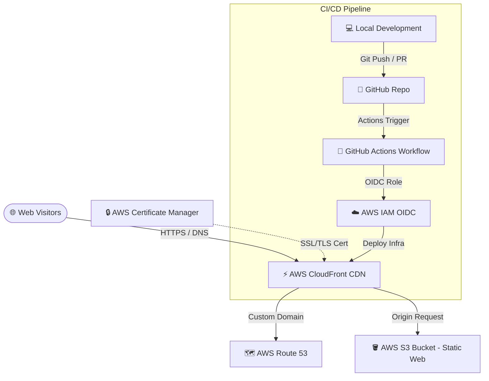

# 🌐 Gideon Jacob's Professional Portfolio Website

[](https://react.dev)
[](https://www.typescriptlang.org/)
[](https://vite.dev)
[](https://tailwindcss.com)
[](https://www.terraform.io/)
[](https://aws.amazon.com/)

Welcome to the repository for **Gideon Jacob's Professional Developer Portfolio Website**. This project represents a highly optimized, modern, and aesthetically premium developer homepage. It combines a state-of-the-art interactive **Frontend Application** with a fully automated, cloud-native **Infrastructure-as-Code (IaC)** deployment pipeline.

The application aggregates real-time stats and showcases professional profiles from major platforms, featuring elegant glassmorphism, responsive charts, and fluid micro-animations.

---

## 🏗️ System Architecture



---

## 🛠️ Technology Stack & Core Features

### 1. The Frontend (`/frontend`)
An ultra-performant React application optimized with the latest compiler and bundler features.
*   **Core UI & Layout**: Built on **React 19**, **Vite 8**, and **TypeScript 6**.
*   **Styling**: Powered by **Tailwind CSS v4** utilizing the native `@tailwindcss/vite` plugin for ultra-fast, compilation-level utility injection.
*   **Dynamic Sections**: Features rich, responsive glassmorphic cards and sliders that pull, display, and structure professional profiles:
    *   💻 **LeetCode**: Problems solved stats, active badges, and contest ratings using dynamic visual charts.
    *   🍳 **CodeChef**: Overall ratings, global ranks, and problem-solving analytics.
    *   🐙 **GitHub**: Profile card containing repository statistics and active language breakdown.
    *   👔 **LinkedIn**: Comprehensive career highlights, role details, and skills ([linkedin.json](./frontend/src/data/linkedin.json)).
    *   🐦 **Twitter/X**: Elegant real-time tweet slider showing recent community engagements ([twitter.json](./frontend/src/data/twitter.json)).
*   **State & Querying**: Integrated with `@tanstack/react-query` (React Query v5) for efficient client caching and asynchronous data synchronization.
*   **Transitions & Visuals**: Premium interactions styled with `framer-motion`, `recharts` (custom visual graphics), and `react-icons`.

### 2. Infrastructure as Code (`/infrastructure`)
A secure, scalable AWS environment managed using **Terraform** to enable predictable deployments.
*   **Static Hosting**: Optimized AWS S3 bucket serving the compiled portfolio assets.
*   **Global Distribution**: CloudFront CDN distribution serving as the main entry point to reduce page load latency globally, secured via Origin Access Control (OAC) to shield the S3 bucket.
*   **HTTPS Encryption**: ACM (AWS Certificate Manager) SSL/TLS certificates configured in the global edge region (`us-east-1`).
*   **Custom Domain Routing**: Route 53 setup directing `gideonjacob.in` and `portfolio.gideonjacob.in` directly to the CloudFront distribution with low-latency DNS resolution.
*   **State Backend**: S3 bucket and DynamoDB table for distributed Terraform state storage and atomic state-locking.

### 3. CI/CD Pipeline Automation (`/.github`)
*   **Automatic Quality Gates**: Validates code and checks formats (`terraform fmt`) on all pull requests.
*   **Safe Execution Plans**: Generates and attaches dry-run execution reports (`terraform plan`) to PR discussions.
*   **Automated Continuous Delivery**: Integrates **AWS OIDC (OpenID Connect)** authentication, allowing GitHub Actions to securely assume an IAM role temporarily and deploy infrastructure resources directly to AWS on merges to the `main` branch.

---

## 📂 Repository Directory Structure

```text
gideon-portfolio-website/
├── .github/
│   └── workflows/
│       └── terraform.yml          # Automated CI/CD deployment pipeline
├── frontend/                      # React 19 portfolio application
│   ├── src/
│   │   ├── components/            # UI components and layout sections
│   │   │   ├── cards/             # Generic re-usable cards
│   │   │   └── sections/          # Social/Platform cards (GitHub, LeetCode, etc.)
│   │   ├── data/                  # Offline metadata (LinkedIn/Twitter JSON)
│   │   ├── hooks/                 # Custom React hooks
│   │   ├── utils/                 # Application constants and format helpers
│   │   ├── App.tsx                # Main application component
│   │   └── main.tsx               # Application entry point
│   ├── index.html                 # Index page structure
│   ├── package.json               # Frontend dependencies & scripts
│   └── vite.config.ts             # Vite bundler configurations
└── infrastructure/                # Terraform Infrastructure as Code config
    ├── bootstrap/                 # Backend Terraform OIDC state bootstrapping
    ├── acm.tf                     # SSL/TLS ACM Certificate definition
    ├── cloudfront.tf              # CloudFront CDN configuration
    ├── main.tf                    # Core Terraform providers & backend configuration
    ├── route53.tf                 # DNS Zone & custom records setup
    ├── s3.tf                      # Static web hosting S3 bucket resources
    └── variables.tf               # Global environment variable defaults
```

---

## 💻 Frontend Development Guide

### Prerequisites
*   Node.js (v18+)
*   npm (v10+)

### Setup Instructions
1.  Navigate to the frontend folder:
    ```bash
    cd frontend
    ```
2.  Install dependencies:
    ```bash
    npm install
    ```
3.  Configure environment variables:
    Create a local configuration file based on the environment template:
    ```bash
    cp .env.example .env
    ```
    Edit `.env` and set your usernames:
    ```properties
    VITE_GITHUB_USERNAME=gideon-jacob
    VITE_LEETCODE_USERNAME=gideonjacob
    VITE_CODECHEF_USERNAME=gideonjacob
    ```
4.  Run the local development server:
    ```bash
    npm run dev
    ```
    Your local server will spin up, usually hosting at `http://localhost:5173`.

5.  Compile a production bundle:
    ```bash
    npm run build
    ```
    The production-optimized static files will be generated in `frontend/dist/`.

---

## ☁️ Cloud Infrastructure Deployment

### Directory Structure Context
- [infrastructure/bootstrap/](./infrastructure/bootstrap/): Provisions the security base-layer (OIDC Role for GitHub Actions and S3 state bucket).
- [infrastructure/](./infrastructure/): Main environment configuration mapping domain records, certs, and CDNs.

### Deployment Operations

#### 1. Security Bootstrapping (One-Time Setup)
Initialize and apply the boostrap layer to provision the AWS OIDC Role and Terraform remote backend infrastructure:
```bash
cd infrastructure/bootstrap/
terraform init
terraform plan
terraform apply
```

#### 2. Provisioning Core Infrastructure
With bootstrapping complete, initialize the parent infrastructure folder which connects to the remote S3 backend state bucket:
```bash
cd infrastructure/
terraform init
terraform plan
terraform apply
```

> [!TIP]
> Ensure your Route 53 DNS Nameservers are linked at your domain registrar so that ACM Certificate Validation succeeds automatically during the provision phase.

---

## 🚀 CI/CD Automated Pipelines

Our automated deployment workflow is configured in [.github/workflows/terraform.yml](.github/workflows/terraform.yml).

### Workflow Triggers
*   **Pull Requests (main branch)**: Triggered on edits to `/infrastructure` or the workflow file. Performs `terraform fmt -check`, `terraform init`, `terraform validate`, and outputs a dry-run `terraform plan`.
*   **Merges / Pushes (main branch)**: Executes the full plan and automatically applies changes (`terraform apply -auto-approve`) using the OIDC role.

---

## 📝 Configuration Links
*   **Frontend Profile Usernames**: Configure usernames in [constants.ts](./frontend/src/utils/constants.ts) or `.env`.
*   **Infrastructure Domain Config**: Set your custom domain or target region in [variables.tf](./infrastructure/variables.tf).
